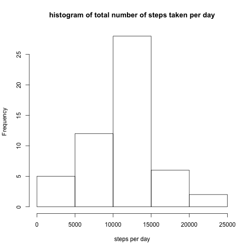
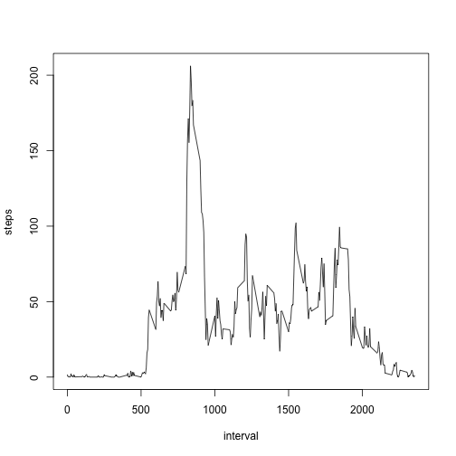
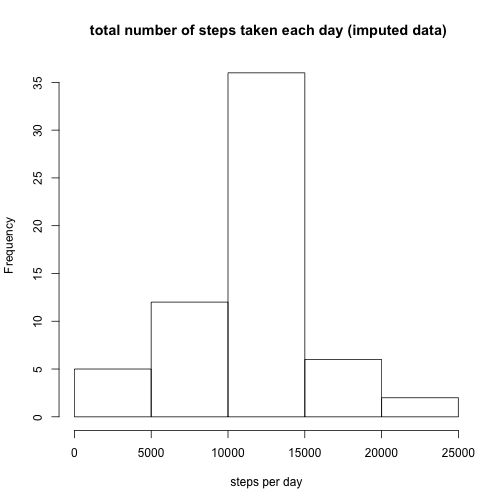

Assessment 1.
================================

Load the data
-------------------------------------------


```r
data <- read.csv("activity.csv", header = TRUE)
data.clean <- na.omit(data)
```
What is the mean total number of steps taken per day?
-------------------------------------------
**1. Histogram**

```r
agr <- aggregate(steps~ date, data = data.clean,sum)
#pdf("histogram_of_steps_per_day.pdf")
hist(agr$steps, xlab = "steps per day", main = "histogram of total number of steps taken per day")
```

 

```r
#dev.off()
```
**2.
Mean number of steps per day**


```r
steps.mean <- mean(agr$steps)
steps.mean
```

```
## [1] 10766.19
```
**Median number of steps per day**


```r
steps.median <- median(agr$steps)
steps.median
```

```
## [1] 10765
```
What is the average daily activity pattern?
-------------------------------------------

**1. Time series plot of the 5-minute interval (x-axis) and the average number of steps taken, averaged across all days (y-axis)**


```r
steps.int <- aggregate(steps~interval, data = data.clean, mean)
plot(steps.int, type = "l")
```

 

**2. Which 5-minute interval, on average across all the days in the dataset, contains the maximum number of steps?**

```r
steps.int[which.max(steps.int$steps),1]
```

```
## [1] 835
```

Imputing missing values
-------------------------------------------

**1. The number of missing values in the dataset is**

```r
length(which(is.na(data)))
```

```
## [1] 2304
```

**2.&3. Use the mean for a give interval to impute missing values and assign to data set named 'data.c'**

```r
rownames(steps.int) <- steps.int$interval
data.c <- data
for(i in 1:dim(data.c)[1]){
	data.c[i,1] <- ifelse(is.na(data.c[i,1]),steps.int[as.character(data.c[i,3]),2],data.c[i,1])
	#print(steps.int[as.character(data.c[i,3]),1])	
}
```
**4. 
Make a histogram of the total number of steps taken each day on the imputed dataset**

```r
agr.imp <- aggregate(steps~ date, data = data.c,sum)
hist(agr.imp$steps, xlab = "steps per day", main = " total number of steps taken each day (imputed data)")
```

 

**Mean number of steps per day (imputed)**


```r
steps.mean.imp <- mean(agr.imp$steps)
steps.mean.imp
```

```
## [1] 10766.19
```
**Median number of steps per day (imputed)**


```r
steps.median.imp <- median(agr.imp$steps)
steps.median.imp
```

```
## [1] 10766.19
```
**In this case imputation of the values did not affect the estimates of the total daily number of steps taken**

Are there differences in activity patterns between weekdays and weekends?
--------------------------------
**1. Create new factor variable - weekday/weekend**

```r
data.c$date <- as.Date(as.character(agr.imp$date))
data.c$day <- weekdays(data.c$date)
data.c$w <- ifelse(data.c$day=="Saturday" | data.c$day=="Sunday","weekend","weekday")
data.c$w <- as.factor(data.c$w)
```
**2. Create a panel time series plot** 

```r
agr.imp.weekday <- aggregate(steps ~ interval, data = data.c[data.c$w=="weekday",],mean)
agr.imp.weekend <- aggregate(steps ~ interval, data = data.c[data.c$w=="weekend",],mean)

par(mfrow = c(2,1))
plot(agr.imp.weekday, type = "l", xlab = "intervals",ylab = "average steps/interval",main = "weekdays")
plot(agr.imp.weekend, type = "l",xlab = "intervals",ylab = "average steps/interval", main = "weekends")
```

 
